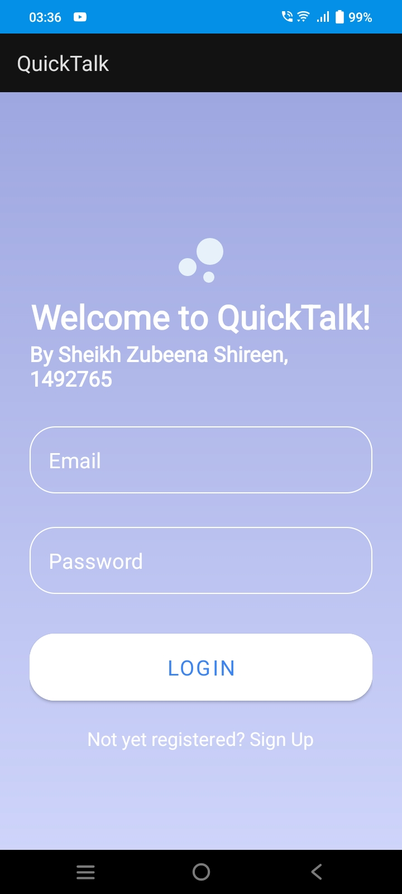

## Intermediate Documentation-

### Chat Application named Quick Talk:

The application serves as a communication medium for two users via chatting. It is built using java in Android Studio.

#### Pre-requisites:

-   Android Studio IDE

-   Firebase for realtime database

#### Features:

-   **Secure sign-up and login:** Users can create account with email, password and login securely.

-   **Real-time messaging:** Users can communicate with other users on the application instantly.

-   **Cloud storage:** Users list, chats are securely stored on Firebase cloud storage to ensure faster, reliable and secure access.

-   **Search User:** Users can search for a user to chat with using the search user feature. It shows users a list of possible users based on user-entered characters.

-   **Chatting:** Users can chat with other users. Text messages are displayed along with timestamp. Received and sent messages are differently color-coded for easier readability.

-   **Edit/Delete texts:** Users can choose to edit or delete their already sent messages.

#### Screenshots

##### Start \| Login \| Signup

.jpeg){fig-align="left" width="149"}

{width="152"}

##### New Chat \| Search User \| Start Chat

#### Getting Started

1.  Create a Firebase project by following Option1 in below documentation <https://firebase.google.com/docs/android/setup>
2.  Firebase Dependencies-

-   **Firebase Authentication**: Service to enable sign-up, login with email and password. Also helps in detecting current signed-in user.

-   **Cloud Firestore**: Flexible, Scalable NoSQL Cloud Database.

3.  Logics to handle new account creation, login existing user, search user to start chatting, chatting , editing and deleting sent messages.
4.  Connect with emulator to run the application.