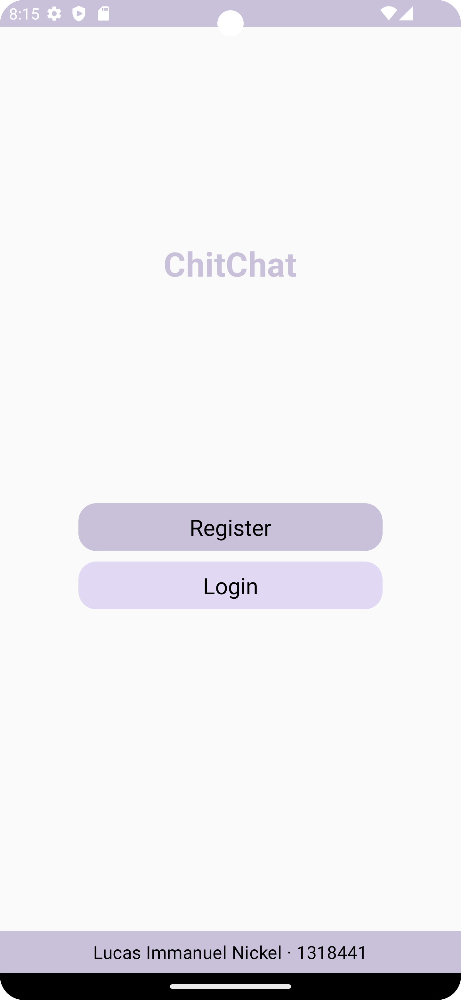
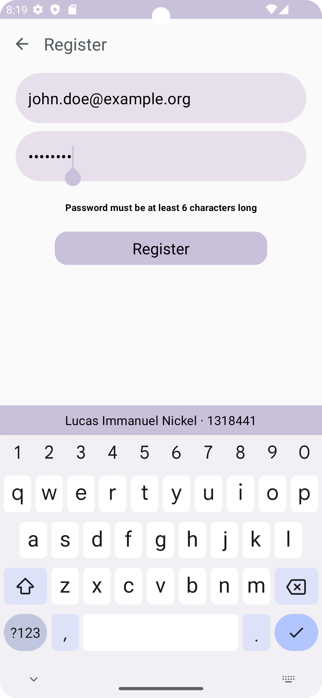
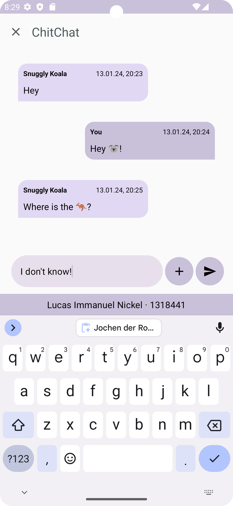
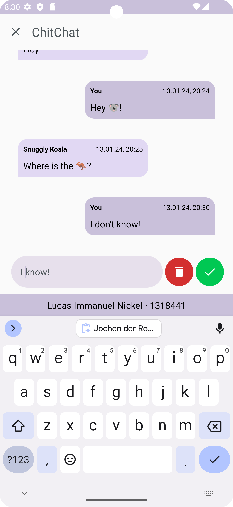
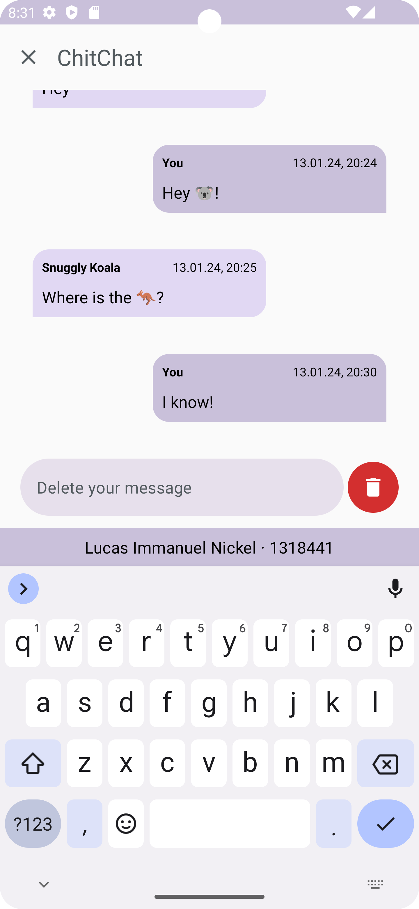
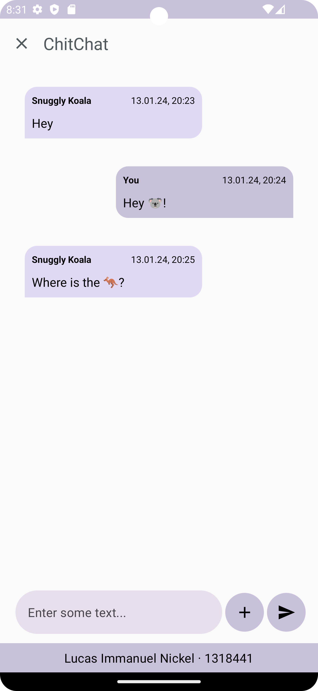
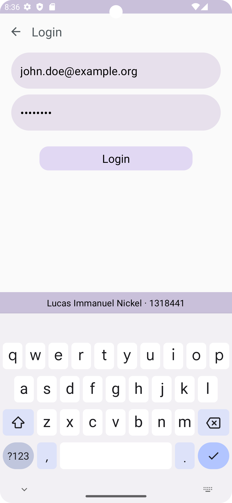

# ChitChat

ChitChat is a chat app for Android. It uses Jetpack Compose for the UI and Firebase as the backend.

## Functionality

The app offers the following functions:

- Exchange of messages between multiple parties
- Authentication based on e-mail address and password
- Registration and login
- The ability to edit and delete messages that have already been sent
- Support for Android version 13 and upwards

## Setup

To use the app, it is necessary to set up the connection to **Firebase**. **Authentication** and **Firestore** must be set up in Firebase. Follow the steps below:

1. Create a new Firebase project with the Analytics interface activated (this is required to use authentication).
2. Activate authentication and the Firestore Database.
3. Add the app to Firebase:
   1. Add the app as an Android app.
   2. The package name of the app is: `com.example.module_3_chitchat.`
   3. You can freely choose the app name.
   4. Add the SHA-1 hash, this is necessary to use Firebase authentication. 
      - You can get the SHA-1 hash with : `./gradlew signingReport` 
   5. Download the `google-services.json` and save it in the `/app` folder of the app.
4. The app should now be ready for use.

## Operation

1. Start the app on multiple emulators in Android Studio or on multiple smartphones.
2. Click on "**Register**" or if you already have an account on "Login":

	

3. Enter your credentials:

	

4. Send messages:

	

5. Hold your messages to edit or delete your messages:

	

6. If you clear the input, your message will be deleted:

	

7. Here you can see how the message was deleted:

	

8. If you click on the X you will be logged out:

	

9. If you click on Login you can then log in again:

	

10. After logging in, you will see the old chat again:

	

## Further development

The following additional functions are to be implemented:

- Management of different chats in a chat overview
- Ability to send and view videos, images, and GIFs

## Attribution

The basis for the implementation of the MVVM pattern in conjunction with Firebase was derived from [here](https://github.com/pradyotprksh/development_learning/tree/main/android/FlashChat).

