# ChitChat - Module 5

ChitChat is a chat app for Android. It uses Jetpack Compose for the UI and Firebase as the backend.

**Note:** The naming of the project as Module_3_Chit_Chat is a relic. It is the code of the fifth module.

## Functionality

The app offers the following functions:

- Exchange of messages between multiple parties
- Authentication based on e-mail address and password
- Registration and login
- The ability to edit and delete messages that have already been sent
- Support for multiple parallel chats
- Support for group chats
- Ability to send view, edit and delete videos, images, and GIFs
- Support for Android version 13 and upwards

## Setup

To use the app, it is necessary to set up the connection to **Firebase**. **Authentication**, **Firestore** and **Storage** must be set up in Firebase.

**Follow these steps:**

1. Create a new Firebase project with the Analytics interface activated (this is required to use authentication).
2. Activate authentication and the Firestore Database.
3. Add the app to Firebase:
   1. Add the app as an Android app.
   2. The package name of the app is: `com.example.module_3_chitchat.`
   3. You can freely choose the app name.
   4. Add the SHA-1 hash, this is necessary to use Firebase authentication.
      - You can get the SHA-1 hash with : `./gradlew signingReport`
   5. Download the `google-services.json` and save it in the `/app` folder of the app.
4. Activate **Authentication**, **Firestore** and **Storage**
5. The app should now be ready for use.

## Operation

1. Start the app on multiple emulators in Android Studio or on multiple smartphones.
2. Click on "**Register**" or, if you already have an account, click on "**Login**":

	

3. **Register** or **log in**:

	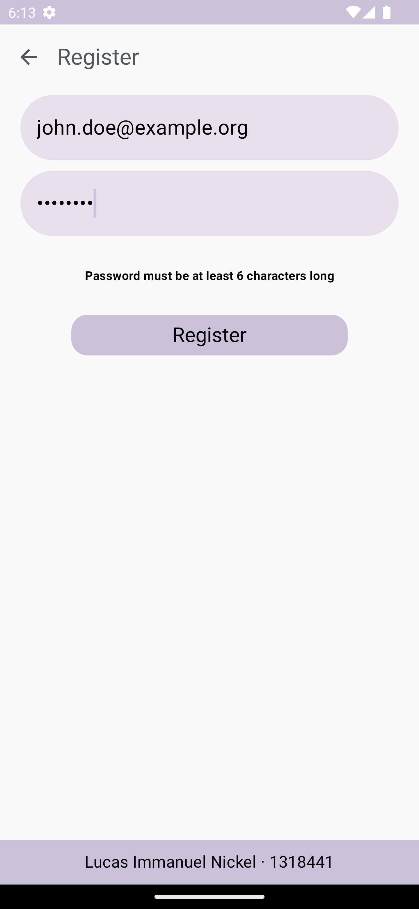

4. A **new chat** can be **created** by entering a **chat name** and then **confirming** it:

	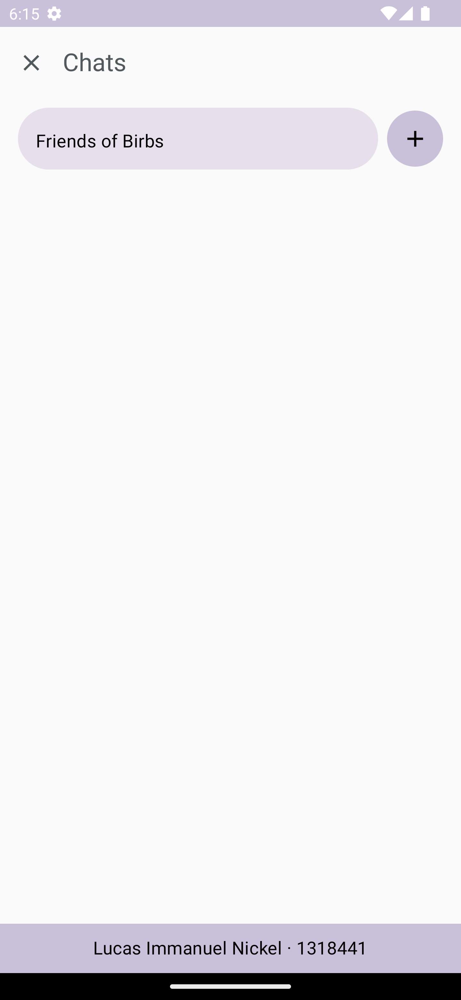

5. Chats have an **invitation code** that always starts with an **@**. These can be used to **join existing chats**

	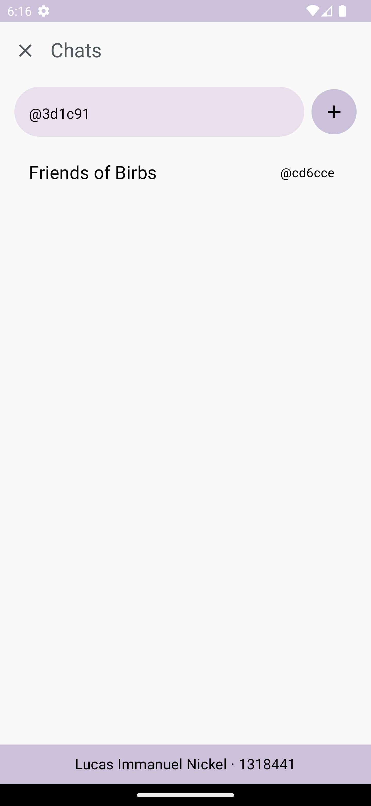

6. By **double-clicking** on the **invitation code**, a chat can be **deleted** from the overview. The **last user** to leave the chat **deletes** the **entire chat data**:

	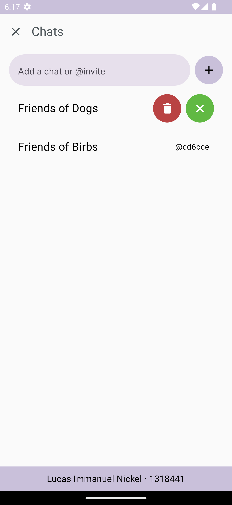

7. Clicking on the **name of the chat** **opens** it:

	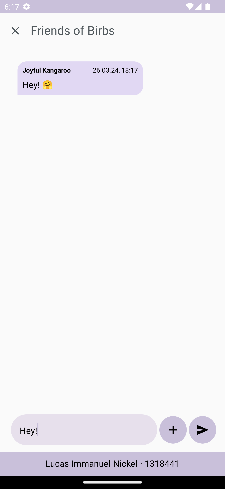

8. **Messages** can be **sent** by using the **text field** and pressing the **send button**:

	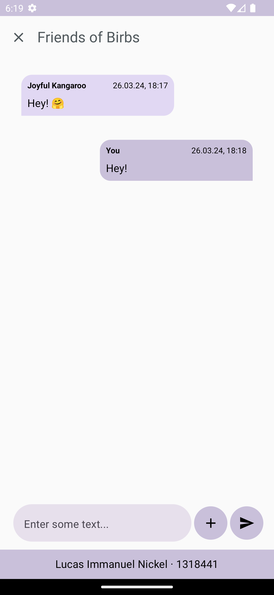

9. **Media** such as **GIFs**, **images**, and **videos** can be sent by pressing the **plus button**.

	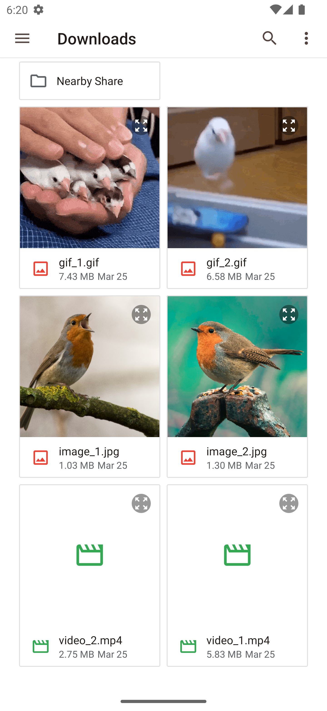

10. **Edit** or **delete** data using the options provided in the **data list**:

	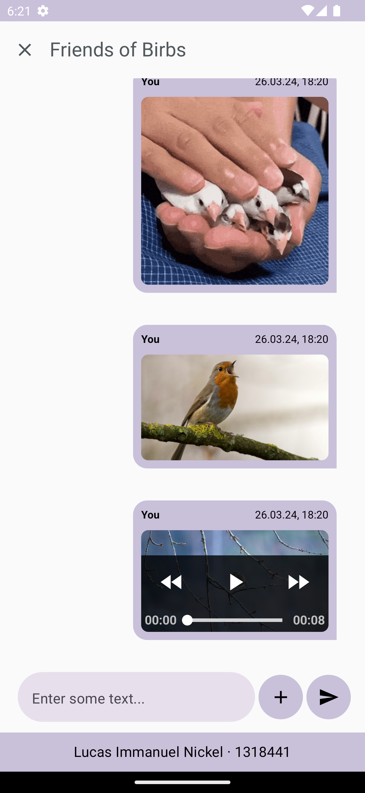

11. By **double-clicking** on the media, they can be **edited** or **deleted**:

	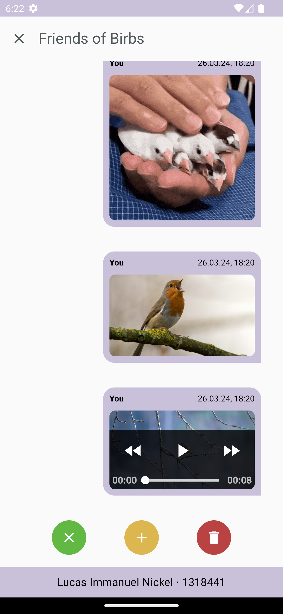

12. By **double-clicking** on **text messages**, these can also be **edited** or **deleted**:

	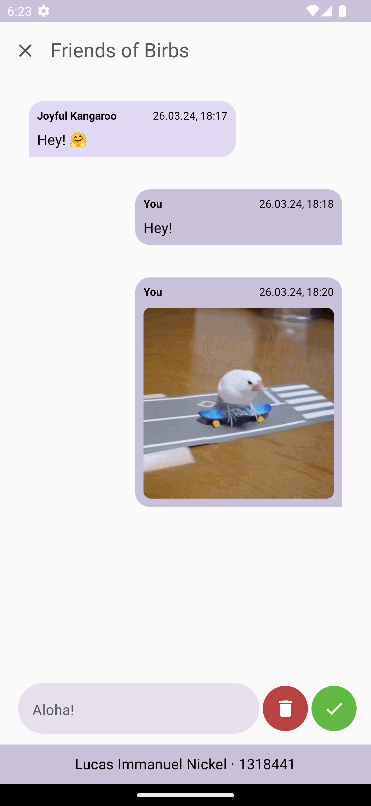

13. The following image shows how the **message text** was **changed**:

	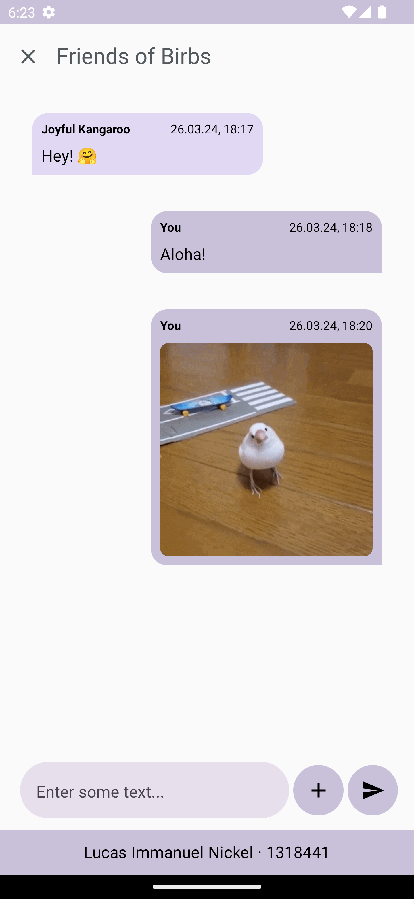

14. The following image shows how everything that the **current user** has **sent** has been **deleted**:

	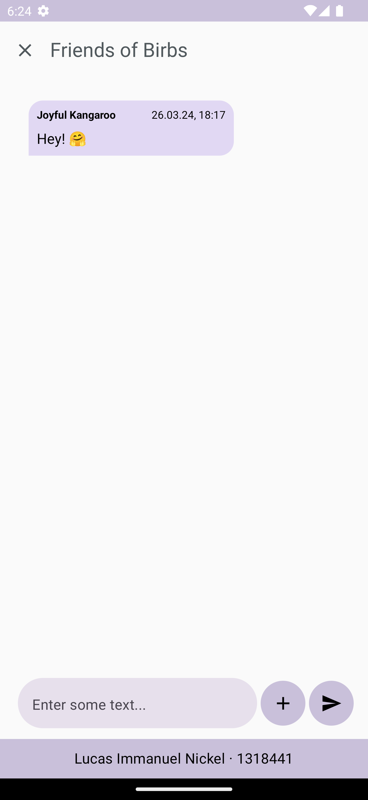

15. **Several people** can **participate** in a chat:

	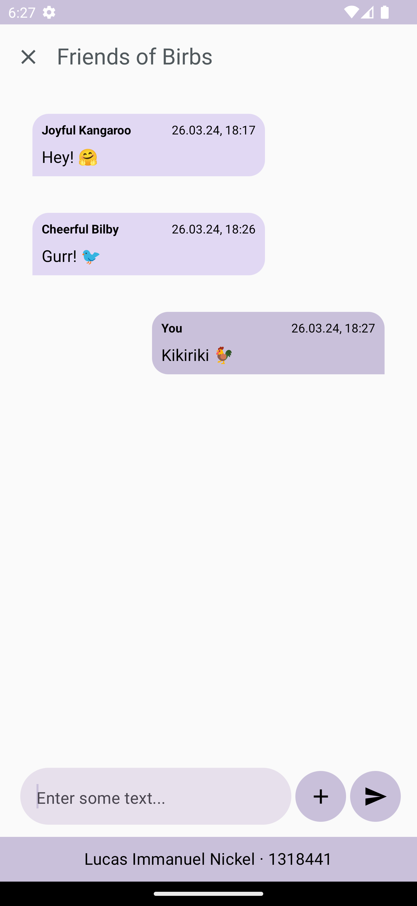

16. To **close** a chat, users can press the **X button**:

	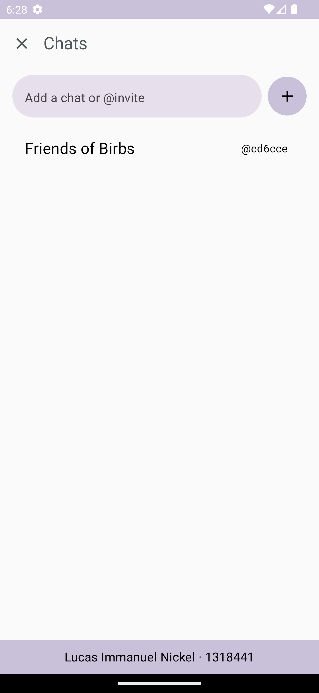

17. Pressing the **X button** in the Chat Overview **logs the user out**:

	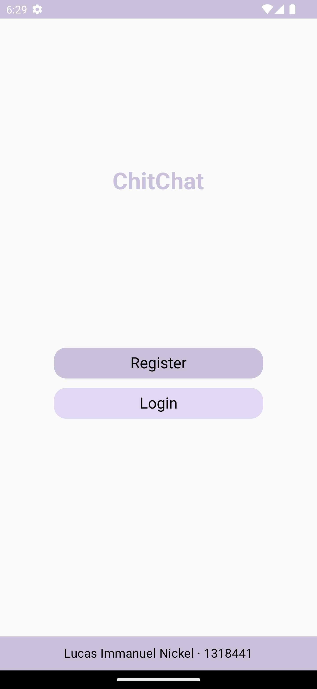

## Attribution

The basis for the implementation of the MVVM pattern in conjunction with Firebase was derived from [here](https://github.com/pradyotprksh/development_learning/tree/main/android/FlashChat).
