# ChatApp Documentation

## Table of Contents

- [Author](#author)
- [Introduction](#introduction)
- [Prerequisites](#prerequisites)
- [Installation](#installation)
- [Features](#features)
- [ViewModels](#viewmodels)
- [UI](#ui)
- [Firebase configuration](#firebase-configuration)
- [What I have learned so far writing this app](#what-i-have-learned-so-far-writing-this-app)
- [Difficulties](#difficulties)

## Author

- Felix Stumpf
- Matriculation ID: 1165939
- HS Fulda / Distributed Applications

## Introduction

This is ChatApp, my Android application designed for Distributed Applications, allowing real-time chat between users.

ChatApp is written in Kotlin and utilizes the following technologies:

- Jetpack Compose
- Google Firebase BaaS (Firebase Firestore, Firebase Authentication)
- MVVM architecture pattern (ViewModels, LiveData)
- Coroutines
- Kotlin Flow
- Kotlin Serialization
- Material 3 Design
- Coil for Images and GIFs
- ExoPlayer for Videos

It is tested through Android API 34 emulators and through physical devices also running Android 14 (Girlfriends' Galaxy S22 because I have an iPhone).

## Prerequisites

To build and run the ChatApp project, ensure you have the following prerequisites installed on your development environment:

- Android Studio with Gradle
- Android SDK

To get the backend working, ensure you have created a project in Google Firebase console.
Make sure that you have enabled Firebase Authentication by e-mail and Firebase Firestore.
Register an Android app and download the google-services.json file from Firebase console.

## Installation

1. Clone the ChatApp repository.
2. Paste the google-services.json from Firebase in the /app folder.
3. Open the project in Android Studio.
4. Build and run the app on an Android emulator or device.

## Features

- User registration and login.
- Chat overview with a list of chat participants.
- Creation of new chats using participants' email address/adresses.
- Sending and receiving messages in chat conversations in realtime. (Private Messages and Groups)
- Editing and deleting already sent messages in realtime.
- Sending images, GIFs and videos as a message and play them if received.
- Usage of Google Firebase BaaS, which is basically a serverless backend.
- Utilization of Material 3 UI components.

## ViewModels

### RegisterViewModel

The `RegisterViewModel` manages user registration functionality using Firebase Authentication.

### LoginViewModel

The `LoginViewModel` handles user login functionality using Firebase Authentication.

### ChatOverviewViewModel

The `ChatOverviewViewModel` works in conjunction with `ChatViewModel` to handle the chat overview and to start new chats.

### ChatViewModel

The `ChatViewModel` orchestrates chat-related operations, such as sending and receiving messages, utilizing Firebase Firestore.

## UI

The UI is realized through Jetpack Compose in Material 3 design.

Every UI element or screen is located in `com.felixstumpf.chatapp.ui.composables`.

The UI is divided into the following screens, realized through Scaffolds:

### UserManagementScreens

The UserManagementScreens are the screens comprising the StartScreen, RegisterScreen, and LoginScreen. These screens handle the initiation of the app in a newly installed state, allowing the registration of a new user and the login or switching of an existing user.

#### StartScreen

The `StartScreen` is the entry point of the application, providing options for user login or registration.

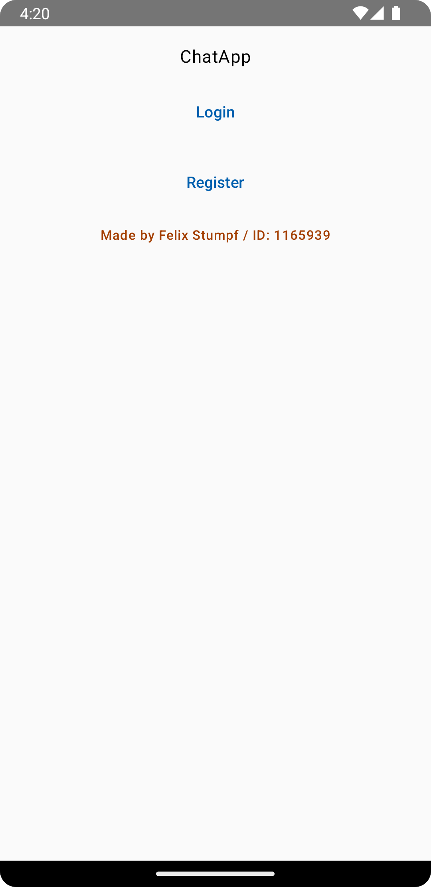

#### RegisterScreen

The `RegisterScreen` allows user registration by capturing email and password information.

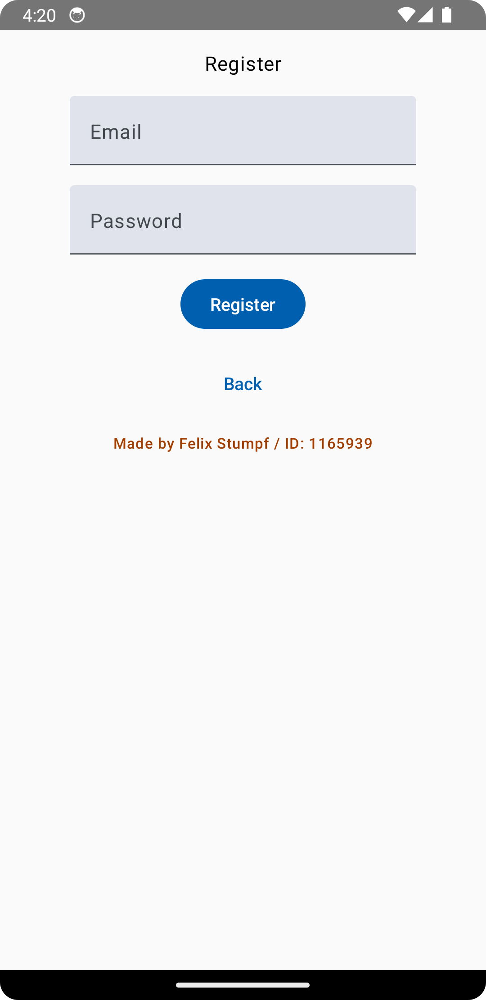

#### LoginScreen

The `LoginScreen` allows users to log in by entering their registered email and password.

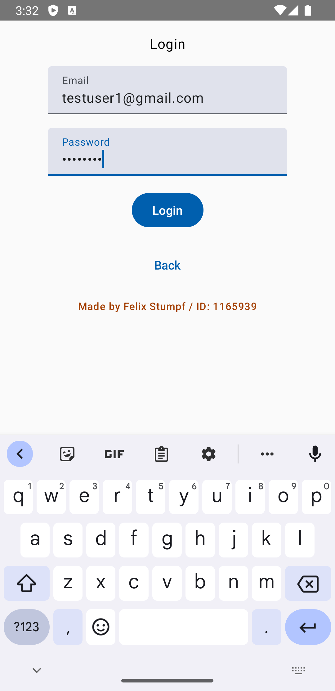

### MainNavController

The `MainNavController` acts as the central hub, directing users to different sections of the app based on their actions.

### ChatOverviewScaffold

The `ChatOverviewScaffold` is the main screen of the app, displaying the chat overview and allowing users to start new chats.
It is made with UI elements that can be found in `ChatOverviewElements`.

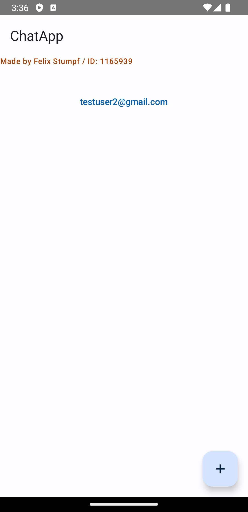

### AddChatDialog

The `AddChatDialog` is a modal bottom sheet for adding new chat conversations.

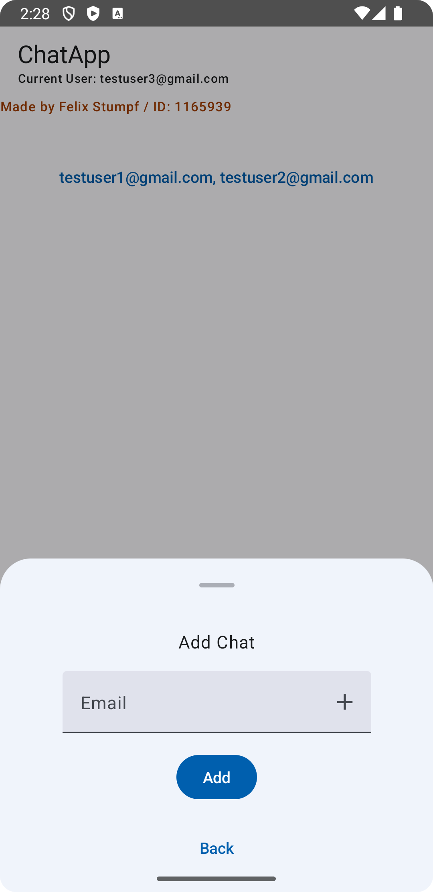

By using the +-Button in the Email Textfield, you can create a group by adding multiple participants to the conversation:

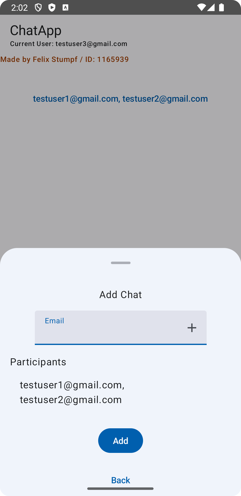

### ChatScaffold

The `ChatScaffold` displays chat conversations, allowing users to send and receive messages.
It is made with UI elements that can be found in `ChatElements`.

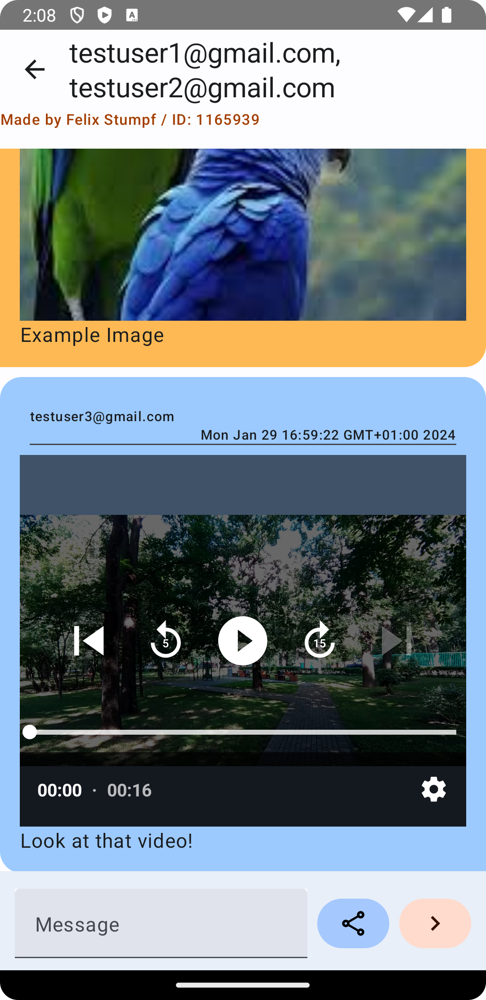

By clicking on the header of the MessageBubble, you can edit or delete the message using the Message Menu:

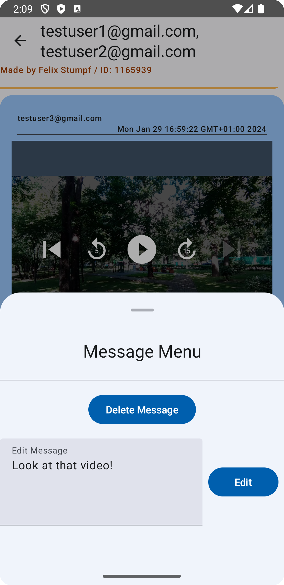

To send media (images, videos, GIFs), the share button can be clicked opening the media menu:

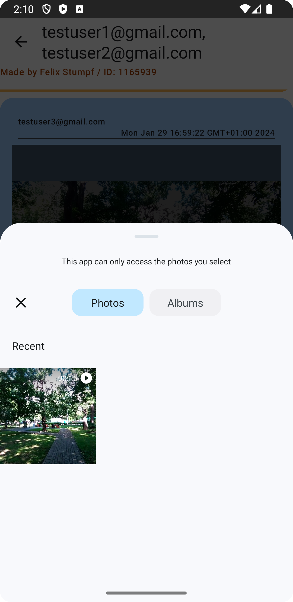

## Firebase configuration

### Authentification

Authenticating users is done through Firebase Authentification through e-mail and password.

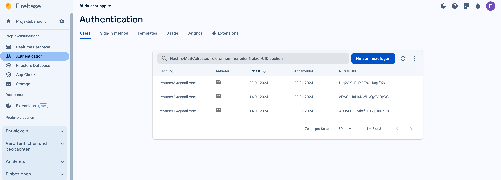

### Firestore

Firestore is used to store the chat messages and the chat participants.

Chats will be stored in the collection `chats`.
Each chat has a document defined by both chat participants' email addresses.

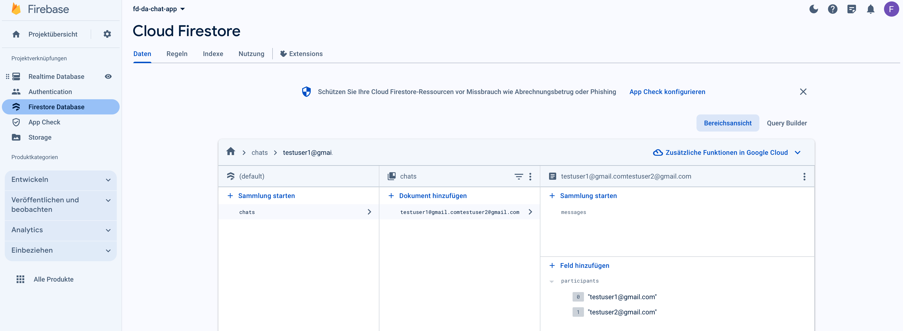

Each chat document has a subcollection `messages`, in which the messages are stored.
Each message is a document generated by a submitted `MessageEntity` object, consisting of

- `id`: Represents the Firebase Document ID where the message is stored
- `message`: The message text
- `senderEmail`: The sender's email address
- `receiverEmails`: The receiver's email address
- `timestamp`: The timestamp of the message
- `mediaType`: MIME-Type of sent media
- `mediaUrl`: URL to Media in Firebase Storage

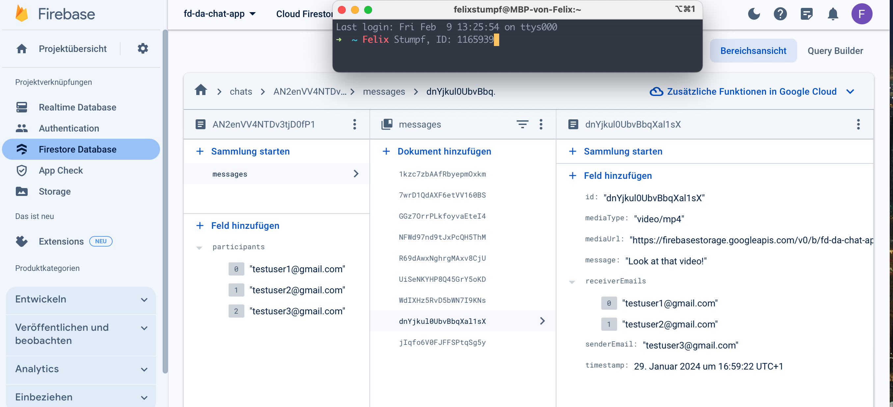

ChatApp queries these documents and listens to changes in the `messages` subcollection to display the messages in realtime.

## Things I have learned writing this app

- Jetpack Compose
- Kotlin language
- Asynchronous programming in Kotlin (Coroutines, Flow)
- Firebase Firestore
- Firebase Authentication
- MVVM architecture pattern in Android
- Kotlin Serialization
- Material 3 Design
- Testing with Emulators
- USB Debugging
- Android Studio functionalities

## Difficulties

- Learning declarative UI programming with Jetpack Compose (Learning syntax and concepts)
- Learning Kotlin language (Differs from the syntax I am used to, very modern language)
- Learning asynchronous programming (Did not do it that much before, on Android it is a must)
- Learning mentioned asynchronous programming especially in Kotlin (Coroutines, Flow -> Very different from C# .NET)
- Learning Firebase Firestore (Lots of new concepts to learn and a lots of documentation to read through, especially about queries and those listeners in combination with asynchronous programming)
- Applying MMVM architecture pattern in Android (Only knew it in C# .NET with WPF and Bindings)
