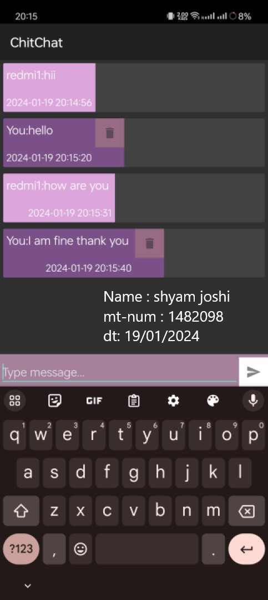
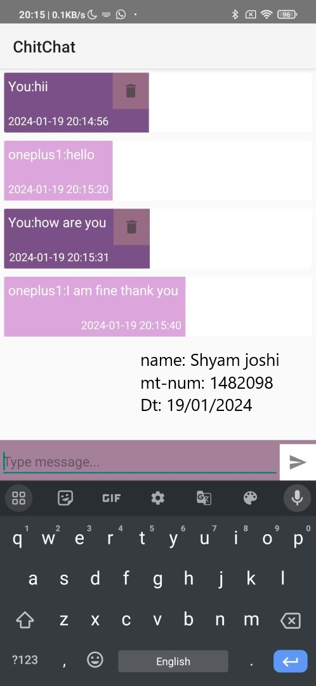

# Firebase Chat Application for Android

This Android chat application utilizes Firebase Realtime Database for real-time messaging. The frontend is implemented using Java for the logic and XML for the user interface.

## Features

- Real-time messaging
- User authentication with Firebase Authentication
- Simple and intuitive user interface
- Firebase Realtime Database for data storage

## Prerequisites

Before running the application, make sure you have the following:

- Android Studio installed
- Firebase project set up with Realtime Database and Authentication enabled

## Setup

1. Clone the repository:

   ```bash
   git clone https://github.com/your-username/firebase-chat-app.git
   ```

2. Open the project in Android Studio.

3. Connect the project to your Firebase project by adding the `google-services.json` file provided by Firebase. Follow the instructions [here](https://firebase.google.com/docs/android/setup) for more details.

4. Run the application on an Android emulator or a physical device.

## Configuration

Make sure to configure your Firebase project properly:

1. Enable Firebase Authentication and set up the authentication method (e.g., Email/Password).

2. Set up Firebase Realtime Database and adjust the security rules as needed.

## Screenshots
<p float="left">



</p>
## Project Structure

- `app/src/main/java/com/example/chitchatapp`: Java code
- `app/src/main/res`: XML layout files

## Core logic

- After opening app user has to sign in or register new account, here I am using firebase authentication.
- user can enter email, password and name.
- user will now be redirected to home screen. where there are list of chats/chatrooms that user has made with other people (this will also show group in future)
- If there are no chat user can create one by clicking on "+" button
- After clicking on any chat user will be redirected to the main chat app
- here user can type messages and they will be sent to other person and vice-versa.

## Dependencies

- Firebase Realtime Database: `com.google.firebase:firebase-database`
- Firebase Authentication: `com.google.firebase:firebase-auth`
- Firebase UI: `com.firebaseui:firebase-ui-auth`

Make sure to check the `build.gradle` file for the latest versions.

