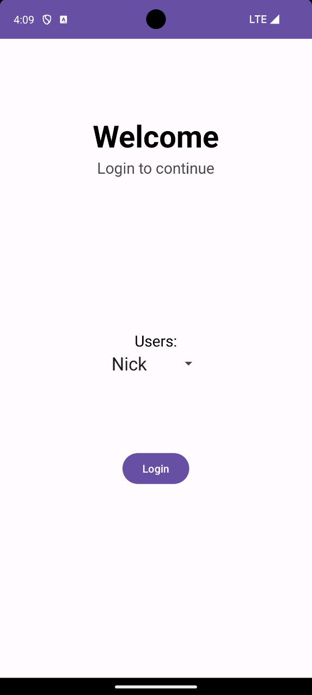
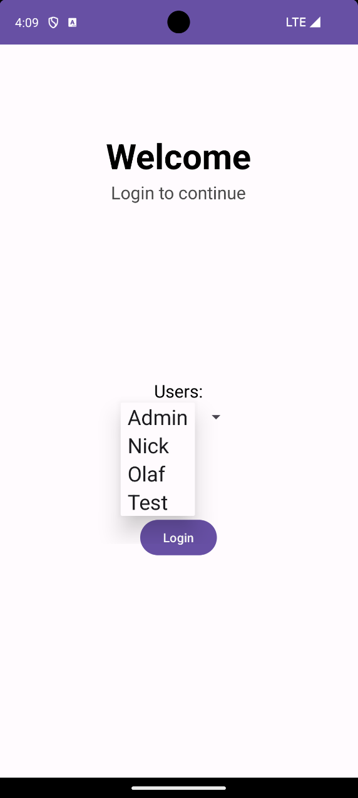
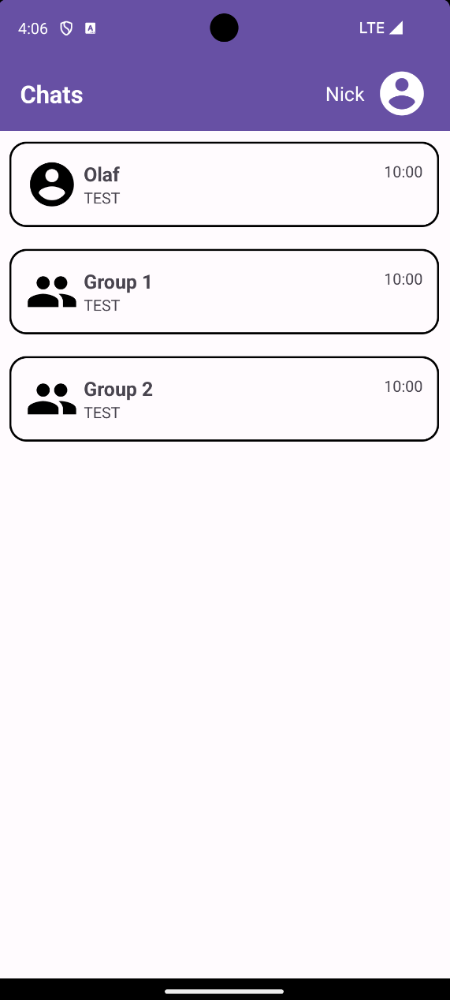
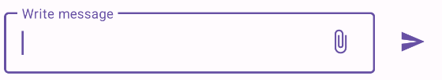
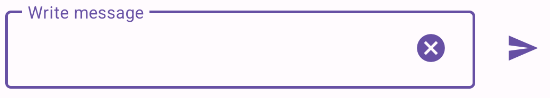
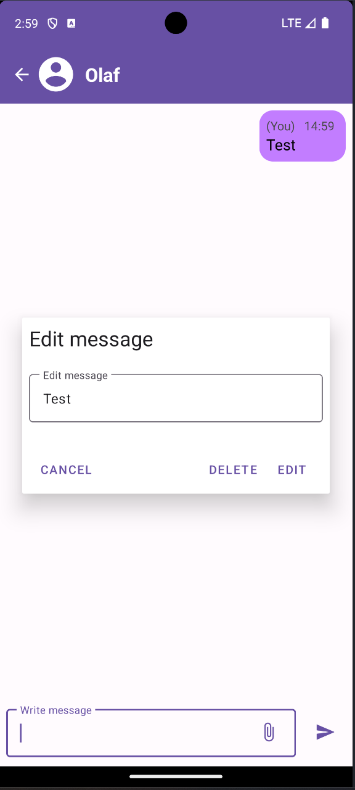
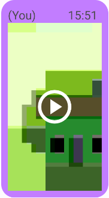
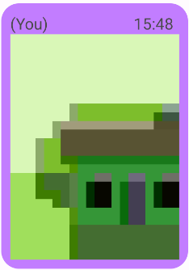
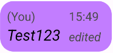
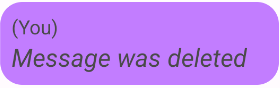

# Real-Time Messaging App Documentation

## Table of Contents

1. [Introduction](#1-introduction)
    - 1.1 [Purpose](#11-purpose)
    - 1.2 [Key Features](#12-key-features)

2. [App Overview](#2-app-overview)
    - 2.1 [Implementation Details](#21-implementation-details)
    - 2.2 [Deployment](#22-deployment)
    - 2.3 [Additional Dependencies](#23-additional-dependencies)

3. [Functionality](#3-functionality)
    - 3.1 [Selecting User](#31-selecting-user)
    - 3.2 [Chat List View](#32-chat-list-view)
    - 3.3 [Sending Messages](#33-sending-messages)
    - 3.4 [Editing/Deleting Messages](#34-editingdeleting-messages)
    - 3.5 [Receiving Messages](#35-receiving-messages)
    - 3.6 [Media Sharing (Sending Images/Videos/GIFs)](#36-media-sharing-sending-imagesvideosgifs)

4. [Offline Functionality](#4-offline-functionality)

5. [Future Enhancements](#5-future-enhancements)

6. [Conclusion](#6-conclusion)

# 1. Introduction

## 1.1 Purpose

The purpose of this Android real-time messaging communication app is to implement a project for real-time text, image, video, and GIF messaging with the ability to edit and delete messages.

## 1.2 Key Features

- Real-time messaging for text, images, videos, and GIFs
- Edit and delete already send message functionality
- Initial user selection via dropdown
- Chat list view with private and group chat functionality

# 2. App Overview

## 2.1 Implementation Details

The app is implemented using Java for Android development.
It uses *Firebase* for the backend to save and distribute data across multiple devices.
*Firebase* is a backend cloud platform with different services. For this project only two of these service were used:
- *[Firebase Realtime Database](https://firebase.google.com/docs/database)*
  - Is a database service for storing and syncing data with a NoSQL cloud database.
  - The data gets synced across all devices in realtime
  - Also, when offline the data is keeps locally
- *[Firebase Storage](https://firebase.google.com/docs/storage)*
  - Is a cloud storage service for uploading and downloading files
  - Files are accessible from the web

Both services have an internal structure that is similar to a file system structure. Is decided on the following design:
### *Firebase Realtime Database Structure*
```
.
├── chats/
│   ├── group/
│   │   └── ${CHAT_ID}
│   └── private/
│       └── ${CHAT_ID}
└── users/
    └── ${USER_ID}
```
### *Firebase Storage Structure*
```
.
└── chats/
    ├── group/
    │   └── ${CHAT_ID}/
    │       ├── image/
    │       │   └── ${IMAGE_ID}
    │       └── video/
    │           └── ${VIDEO_ID}
    └── private/
        └── ${CHAT_ID}/
            ├── image/
            │   └── ${IMAGE_ID}
            └── video/
                └── ${VIDEO_ID}
```

> ***Note:*** The ${USER_ID} and ${CHAT_ID} are the corresponding objects saves with their UUID as the key

## 2.2 Deployment

Deployment is pretty easy, because a user only needs to install the apk of the app and have an internet connection to the *Firebase* services.
Because of *Firebase* we don't need to deploy them ourselves.

<a id="23-additional-dependencies"></a>
## 2.3 Additional Dependencies 

- ```pl.droidsonroids.gif:android-gif-drawable:1.2.28```
- ```com.google.android.material:material:1.10.0```
- ```com.google.gms.google-services```
- ```com.google.firebase:firebase-bom:32.7.0```
  - ```com.google.firebase:firebase-database```
  - ```com.google.firebase:firebase-storage```

# 3. Functionality

## 3.1 Selecting User

Upon opening the app, users can select their profile from a dropdown menu.
These are fixed, can only be changed programmatically and have no security measures because it was not in the specifications.




A user has multiple attributes that get filled and automatically saved inside the *Firebase Realtime Database* with Object-Relational Mapping (ORM).

### User Model

| Variable  | Type   | Required | Definition                                        |
|-----------|--------|----------|---------------------------------------------------|
| id        | String | X        | UUID for identifying the user                     |
| name      | String | X        | Display name of the user                          |
| createdAt | String | X        | A date timestamp string when the user was created |

## 3.2 Chat List View

<div style="display: flex; align-items: flex-start;">
  <div>
    

After the user selection the app redirects to the chat list view. It provides an overview of all available chats.
Currently, there are two types of chats:
1. Private Chats
   1. A private chat only has two members.
   2. The name of the chat is always the other users name (The one who will receive the message).
2. Group Chats
   1. A group chat can have multiple/unlimited users, but needs at least one user for creation.
   2. The name can be anything as long as it is a string and is set on creation.
   3. Additionally, a group chat also saves the id of the user that created the chat.

Other than that all properties and functionalities of the chats are the same. That's the reason why internally these are handled with a *Chat* Interface.

The user can select a chat by clicking on it. After that the chat will open in a new view, which shows the whole conversation of all members.
  </div>
</div>

> ***Note:*** Currently the timestamp and text of the "last message" are static and are not set dynamically.

A chat has multiple attributes that get filled and automatically saved inside the *Firebase Realtime Database* with Object-Relational Mapping (ORM).

### Chat Model

| Variable     | Type             | Required | Chat Type | Definition                                                             |
|--------------|------------------|----------|-----------|------------------------------------------------------------------------|
| id           | String           | X        | P/G       | UUID for identifying the chat                                          |
| type         | PRIVATE \| GROUP | X        | P/G       | Enum for differentiating private and group chats after deserialization |
| memberIdList | List\<String>    | X        | P/G       | List of user UUIDs that are inside the chat                            |
| createdAt    | String           | X        | P/G       | A date timestamp string when the chat was created                      |
| messageList  | List\<Message>   | -        | P/G       | List of all Messages inside the chat                                   |
| creatorId    | String           | X        | G         | A date timestamp string who the chat was created by                    |
| title        | String           | X        | G         | A flag for indicating if a message was deleted                         |

> ***Note:*** P: Private Chat, G: Group Chat

## 3.3 Sending Messages

Users can send real-time messages, including text, images, videos, and GIFs.
A chat has three ui elements at the bottom that are relevant for sending messages:
- *Edit text field* : 
  - Opens Keyboard when focused. 
  - Holds the text message that will be sent on submit.
- *Attach button* : 
  - Opens the Media share dialog for selecting one image/video/gif.
  - Saves the reference until submission.
  - After selection the button will change to an **X** for deleting the saved media reference.
- *Send button* : 
  - Saves the message inside *Firebase* (*Firebase Realtime Database*/*Firebase Storage*) and notifies all other devices.
  - For saving a message, one of the following properties must be met:
    - *Edit text field* is not empty/blank.
    - One media reference must be selected.
  - At last the *Edit text field* and the *Attach button* reset.


  
  

A message has multiple attributes that get filled and automatically saved inside the *Firebase Realtime Database* with Object-Relational Mapping (ORM).

### Message Model

| Variable   | Type    | Required | Definition                                                                         |
|------------|---------|----------|------------------------------------------------------------------------------------|
| index      | int     | X        | Propagating index that for every new message will get raised by one                |
| message    | String  | (X)      | This variable hold the raw text message that the user typed in                     |
| mediaUrl   | String  | (X)      | Firebase Storage url for the media that is used for downloading images/videos/gifs |
| senderId   | String  | X        | Id of the user that created the message                                            |
| lastEdited | String  | -        | A date timestamp string when the message was edited last                           |
| isEdited   | boolean | -        | A flag for indicating if a message was edited                                      |
| isDeleted  | boolean | -        | A flag for indicating if a message was deleted                                     |

> ***Note:*** (X) marks the variables of which at least one is required

## 3.4 Editing/Deleting Messages

<div style="display: flex; align-items: flex-start;">
  <div>
    

Message editing and deletion functionality is available for users, by holding down on a message for a few seconds.
After that, a Dialog opens up where the user has multiple ui elements to interact with:
- *Edit message field*
  - Used for changing the text of a message.
  - The default value is the value of the message
- *Cancel button*
  - Abort the edit dialog, so no changes to the message are applied.
  - Alternatively the user can just click anywhere else on the screen except the dialog itself to abort the edit.
- *Delete button*
  - Will delete the text of the message and mediaUrl (Also the file itself in the *Firebase Storage* and the cached file).
  - Sets the *isDeleted* flag of the message to true for correct rendering.
- *Edit button*
  - Will overwrite the text of the message
  - Sets the *isEdited* flag of the message to true for correct rendering.
  </div>
</div>

> ***Note:*** Only the sender of the message has the ability to open this dialog. In other words to edit and delete the message.

## 3.5 Receiving Messages

A database listener for the specific messages inside the chat gets subscribed after selecting it. Because of that we get all existing, new, updated messages in realtime from the *Firebase Realtime Database*.
The app renders them depending on the properties and content of the message:

## Message Handling
| Variable   | Handling                                                                                                                                                                                                                                                                                                                                                                                           |
|------------|----------------------------------------------------------------------------------------------------------------------------------------------------------------------------------------------------------------------------------------------------------------------------------------------------------------------------------------------------------------------------------------------------|
| index      | Is used for the order of rendering the message.                                                                                                                                                                                                                                                                                                                                                    |
| message    | Raw Text message that gets rendered.                                                                                                                                                                                                                                                                                                                                                               |
| mediaUrl   | This url indicates the media resource and depending on the type will get rendered as a image/video/gif.<br/> First tries to get from local cache otherwise downloads it. |
| senderId   | Used for displaying the sender name:<br/>-Sender is the current user: ***(You)***<br/>-Sender is **not** the current user: ***Name of sender***                                                                                                                                                                                                                                                    |
| lastEdited | Contains the date for the message timestamp and gets rendered as a time of day                                                                                                                                                                                                                                                                                                                     |
| isEdited   |  - True: *edited* text will get shown on message and whole message will get rendered cursive.<br/> - False: Default, normal rendering.                                                                                                                                             |
| isDeleted  | - True: text will get overwritten with ***Message was deleted*** and whole message will get rendered cursive.<br/> - False: Default, normal rendering.                                                                                                                           |

## 3.6 Media Sharing (Sending Images/Videos/GIFs)

After selecting a media from local storage and sending the message the upload gets initialized. In this step the whole application freezes to stop user input and displays a loading spinner that indicates the progress of the upload. 


After a successful upload the media file gets saved to the cache with a reference to the local cache path from the Firebase mediaUrl for later use. This is to limit network traffic, because media files can be pretty big.
This happens for all members of the chat. The different media types get rendered as following:
- Images
  - Basic Image View.
- Videos
  - Basic Video View with additional play and pause functionality.
  - Click to play video or pause it.
- GIFs
  - Like the Image View just as an animation that loops indefinitely.

# 4. Offline Functionality

Due to the Firebase API, all calls are cached, allowing users to view users, chats and messages offline. With the addition of the cached media files the user is also able to view already downloaded files offline.

> ***Note:*** Offline functionality is limited; certain features such as sending or editing messages are restricted in offline mode.

# 5. Future Enhancements

The project specifications should all be met but the following additional functions could be implemented to improve the application:

- Fully functional and secure authentication of user with additional registration
- Ability to create new chats inside the application
- Improving the Design

# 6. Conclusion

In conclusion, this Android real-time messaging app should provide all essential features for the project requirements with additional optional features, enabling real-time communication and collaboration.

