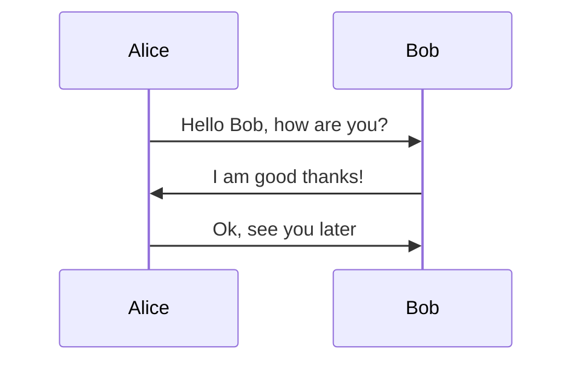

# Hamro Kurakani

## App Description
Hamrokurakani is a simple chat application.

## UML diagrams




## Backend Setup Steps

1. **Install Python3 and PIP:** Make sure you have python 3 and pip installed on your machine.
2. **Navigate to Backend Directory `cd HamroKurakaniBackend`**
3. **Run `pip install -r requirements.txt ` command to install all the dependencies.**

4. **Create and .env file with following content:**
   ```
	DB_HOST=<Database host>
	DB_USER=<Database username>
	DB_PASSWORD=<Database password>
	DB_NAME=<Database name>
	DB_PORT=<Database port>
	JWT_SECRET_KEY=<Secure secret for jwt tokens>
	SOCKET_SECRET_KEY=<Secure secret for socket>
   ```
5. **Run command `python server.py`**

## Android app setup steps

1. **Configure Android Device**: Follow the official React Native guide to configure your environment: https://reactnative.dev/docs/environment-setup
2. **Install Node and NPM:** Make sure you have Node.js and NPM installed on your machine.

3. **Navigate to Frontend Directory `cd HamroKurakaniApp`**
4. **Run `npm install` command to install all the dependencies.**

5. **Create and .env file with following content:**
   ```
	API_URL=<URL to backend>
   ```
6. **Run command `npm run start`**