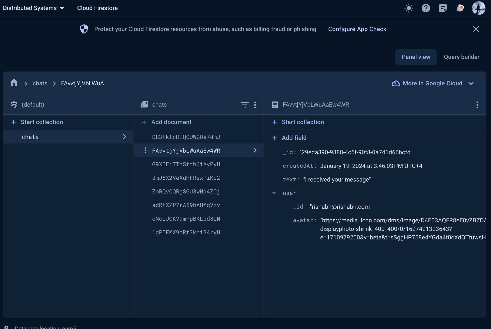

# WhatsDown App with Firebase

This is a basic chat application using Firebase Authentication for user authentication and Firestore for storing chat data and showing chat in realtime.

## Prerequisites

Before running the project, ensure you have the following:

1. **Firebase account:** [Firebase Console](https://console.firebase.google.com/).
2. **Firebase project set up with Authentication and Firestore enabled.**

## Project Setup

1. **Open the project in Android Studio.**

2. **Connect your app to Firebase:**

    - Follow the instructions to add your Android app to the Firebase project: [Add Firebase to your Android project](https://firebase.google.com/docs/android/setup).
    - Download the `google-services.json` file and place the credentials in your project.

3. **Enable Authentication in Firebase:**

    - In the Firebase Console, navigate to Authentication and enable the sign-in method you prefer (email/password, Google, etc.).

5. **Set up Firestore:**

    - In the Firebase Console, navigate to Firestore and create a new database. Choose the location and set up your security rules.

## Dependencies

The project uses the following dependencies:

- Firebase Authentication
- Firestore
- Firebase UI for Android

## Running the App

1. Build and run the app using Android Studio.

2. Register a new account or log in using an existing account.

3. Start chatting with other users

## Project Structure

The project follows a simple structure:

- `app/src/main/java/com.example.chatapp`: Contains the Java code.
    - `firebase`: Authentication and firebase related classes.
    - `chatActivity`: Chat-firebase related classes.
    - `MainActivity.java`: Entry point of the app.
    
- `app/src/main/res`: Contains resources such as layout files, drawables, and values.

