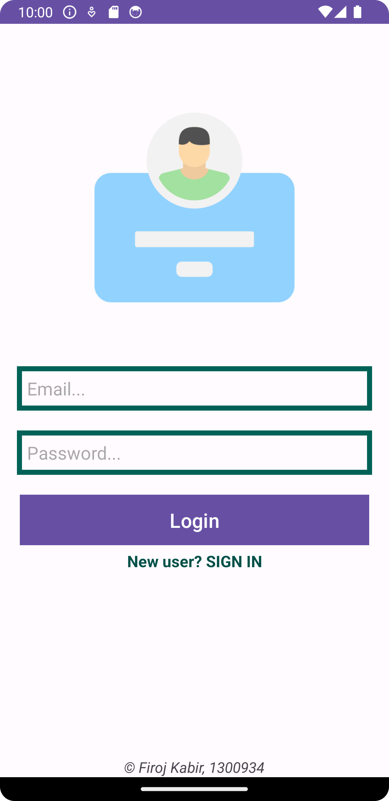
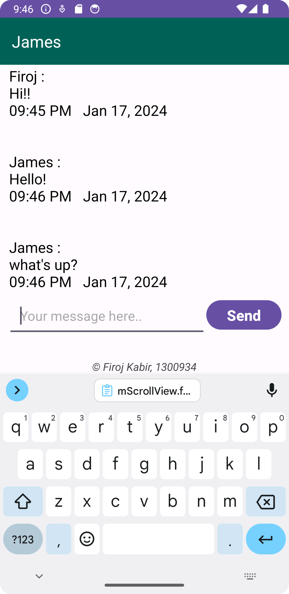

# ChitChat - Android Chat Application

ChitChat is a real-time Android chat application developed in Android Studio using Java, XML, and Firebase. It allows users to sign up using their email and create a profile with their name and status. Users can send and receive messages instantly, and the application securely handles authentication using FirebaseAuth. User profiles and chat messages are stored in the FirebaseDatabase.

## Features

#### 1. User Authentication:

- Users can sign up using their email address, and authentication is managed securely through FirebaseAuth.

#### 2. Profile Management:

- Once signed up, users can update their profiles by adding their name and profile status.

#### 3. Real-time Chat:

- ChitChat provides a real-time chat experience, allowing users to send and receive messages instantly.

#### 4. Firebase Realtime Database:

- The application utilizes Firebase Realtime Database to store and synchronize user profiles and chat messages across devices in real time.

## Technologies Used

- #### Java:

  - The backend logic of the application is written in Java, providing the necessary functionality.

- #### XML:

  - XML is used for designing the user interface (UI) layout, creating an intuitive and user-friendly chat experience.

- #### Firebase:
  - ChitChat relies on Firebase for user authentication (FirebaseAuth) and real-time data storage (Firebase Realtime Database).

## How to Use

#### 1. Clone the project:

```properties
 https://github.com/krimuru9336/AI5109-Distributed-Applications/tree/fdai6491/modules/ChitChat
```

#### 2. Open in Android Studio:

- Open the project in Android Studio to explore, build, and run the application on an Android emulator or device.

#### 3. Set Up Firebase:

- Create a new project on the Firebase Console.
- Connect your Android app to the Firebase project by adding the configuration file (**google-services.json**) to the app module.
- Enable Firebase Authentication and Realtime Database.

#### 4. Run the Application:

- Run the ChitChat application on an Android emulator or device.

## Screenshots



